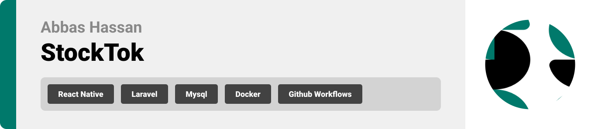

  

<!-- project overview -->

> StockTok is a bold new platform where creators and investors fuel the next wave of viral content.
> It merges the power of social media with the dynamics of financial markets, letting creativity become a shared investment.
> In StockTok, every video is an opportunity and every click can be a return.

  

<!-- System Design -->
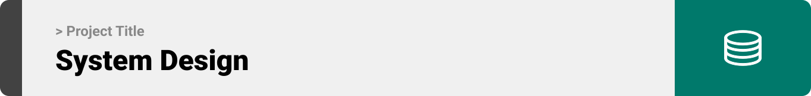

> The backend of StockTok is built with a clean relational structure that powers video content, user investments, wallet management, and social interactions.

#### ER Diagram

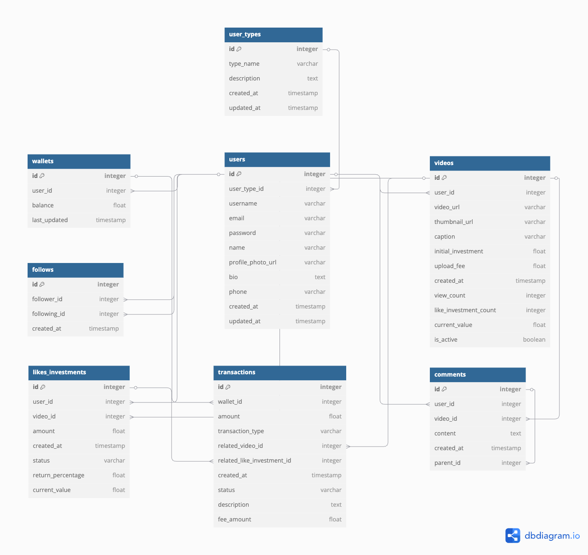

#### Component Diagram

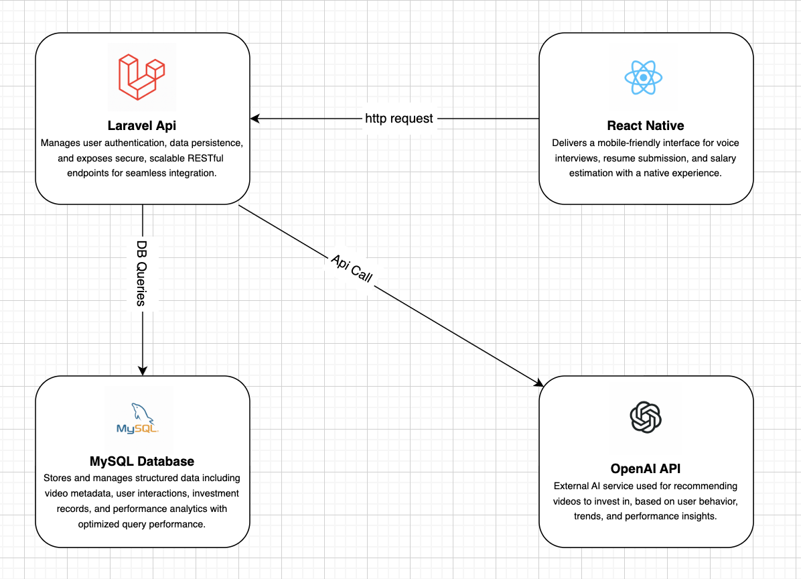

  

<!-- Project Highlights -->
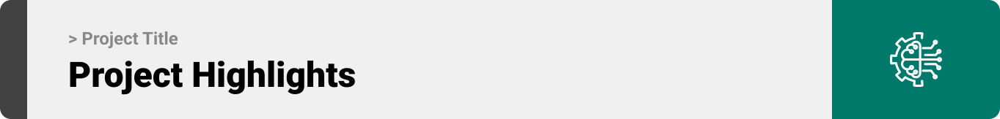

> - Paid likes act as investments, users can invest in videos they believe in.
> - AI-powered suggestions recommend promising videos to help investors make smarter decisions.
> - Infinite video streaming with vertical scroll for a TikTok-style experience.
> - Users can upload and stream videos seamlessly with real-time playback.

<!-- Demo -->

### Investor Screens (Mobile)

| Investment Details Screen        | Video Feed Screen          |
| -------------------------------- | -------------------------- |
| 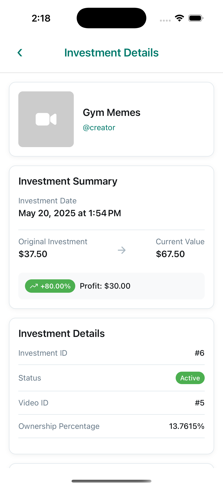 |  |

### Creator Screens (Mobile)

| Dashboard Screen                     | Wallet Screen                  |
| ------------------------------------ | ------------------------------ |
| 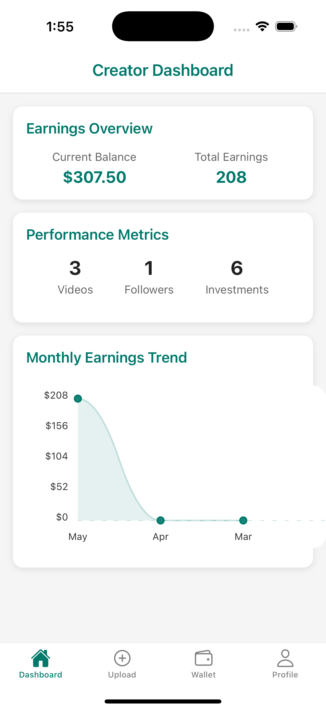 | 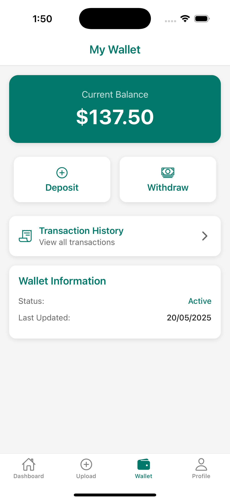 |

  

<!-- Development & Testing -->

> This section highlights how StockTok handles core backend logic, validation layers, and testing.
>
> - **Services:** Core business logic is separated into service classes, making the app modular, maintainable, and scalable.
> - **Validation:** All incoming requests go through dedicated validation layers to ensure data integrity and security.
> - **Testing:** Critical actions like video uploads are covered with feature tests to ensure stability during CI/CD and production.

| Services                                    | Validation                                        | Testing                               |
| ------------------------------------------- | ------------------------------------------------- | ------------------------------------- |
| 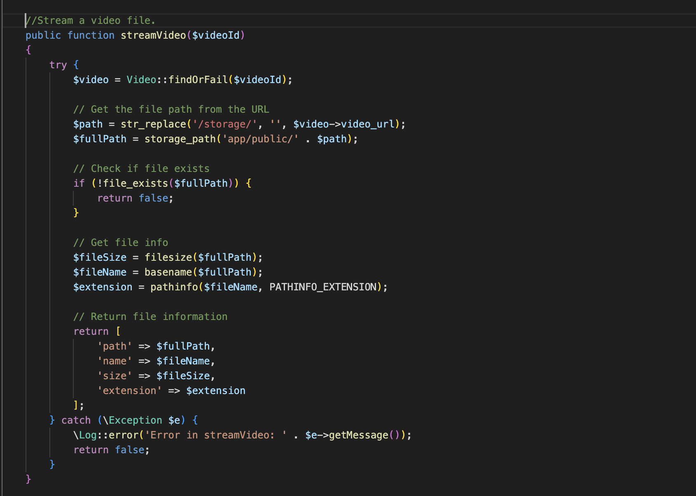 | 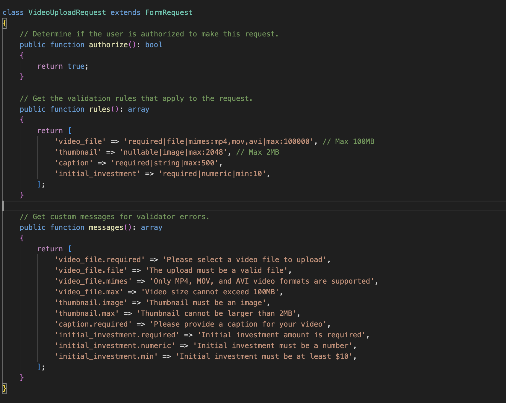 | 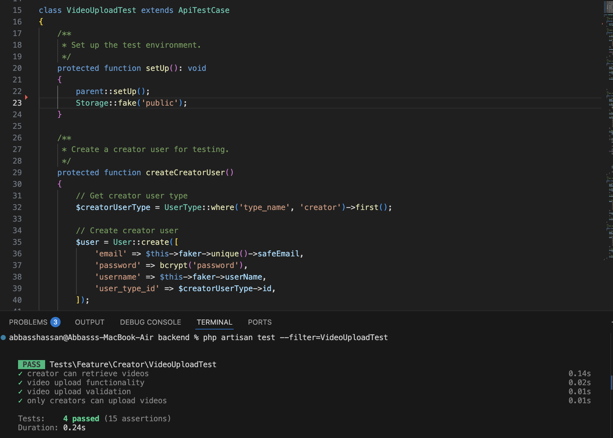 |

  

<!-- AI-Powered Recommendations -->

> StockTok uses AI to provide personalized portfolio guidance:
>
> 1. **Portfolio Assessment** – The AI reviews the user's current investments and performance.
> 2. **Diversification Strategy** – It suggests how to balance the portfolio with new content categories or creators.
> 3. **Recommended Videos** – It identifies trending videos worth investing in with clear reasons for each pick.

| AI Prompt Input (User Portfolio & Trends) | AI Output (Recommendations & Strategy) |
| ----------------------------------------- | -------------------------------------- |
| 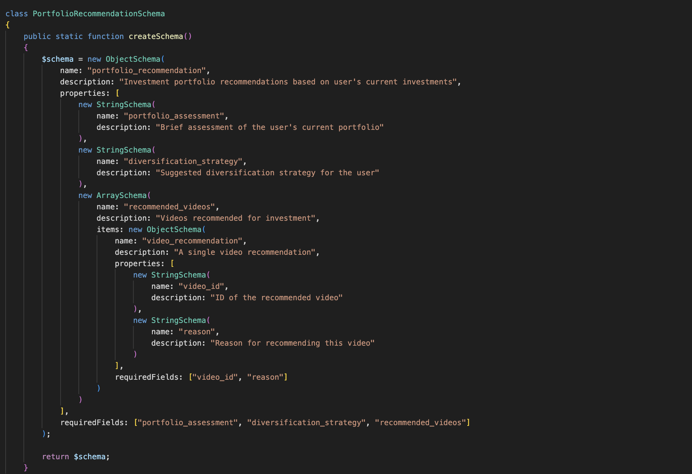                  | 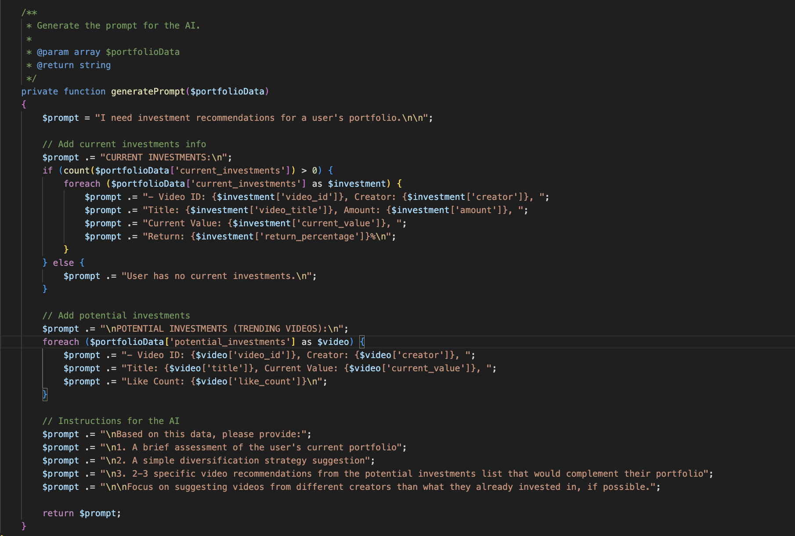               |

  

<!-- Deployment -->

### Deployment Overview

- The StockTok app is deployed using **AWS EC2 instances**:
  - **Staging:** `http://13.37.224.245`
  - **Production:** `http://35.181.171.137`
- The application is **containerized using Docker** to ensure consistency across all environments.
- **CI/CD pipelines** are implemented via **GitHub Actions**, enabling automatic testing and deployment on every push to `main`.

| GitHub Actions Deployment Log  | Production Endpoint in Use         | Staging Endpoint in Use            |
| ------------------------------ | ---------------------------------- | ---------------------------------- |
| 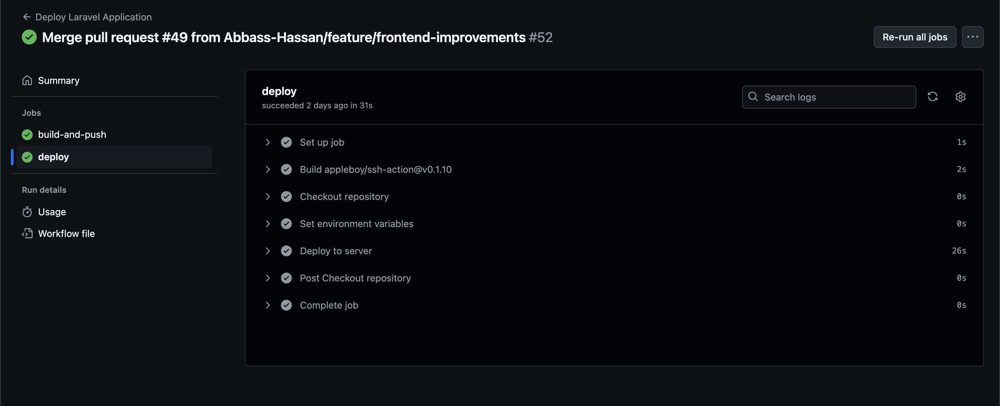 | 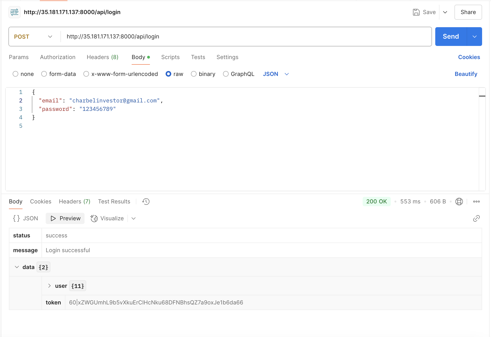 | 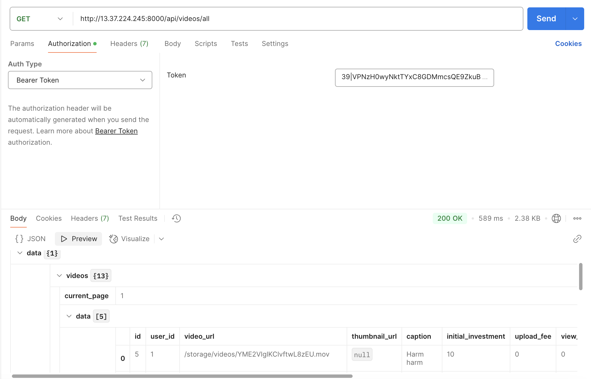 |

  
